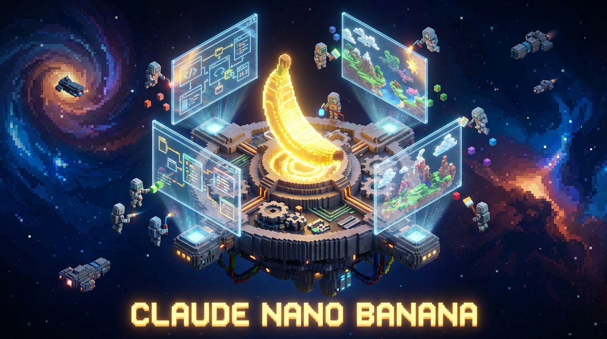
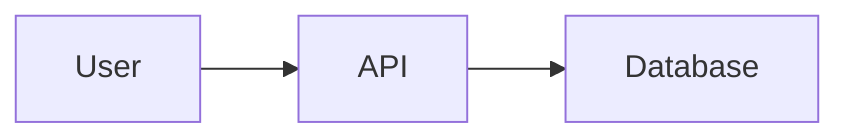

<p align="center">
  
</p>

<p align="center">
  <a href="https://github.com/flight505/nano-banana"></a>
  <a href="LICENSE"></a>
  <a href="https://github.com/anthropics/claude-code"></a>
</p>

<p align="center">
  <strong>AI-powered image and diagram generation for Claude Code</strong><br>
  Using Nano Banana Pro (Gemini 3 Pro Image) with intelligent quality review
</p>

---

## ✨ Features

- 🚫 **Zero Dependencies** - Uses Python stdlib only, works everywhere (no PEP 668 issues!)
- 🎯 **Smart Iteration** - Only regenerates when quality is below threshold (saves API calls)
- 📊 **Document-Type Aware** - 13 quality presets (journal, architecture, presentation, etc.)
- 🔍 **AI Quality Review** - Gemini 3 Pro reviews each generation
- 🎨 **Multiple Skills** - Technical diagrams, general images, and Mermaid text diagrams
- ✏️ **Image Editing** - Modify existing images with natural language
- 📝 **Version Control** - Mermaid diagrams are text-based and git-friendly

## 🚀 Quick Start

### 1. Install the Plugin

Clone or download to your Claude Code plugins directory:

```bash
git clone https://github.com/flight505/nano-banana.git
```

### 2. Configure API Key

Get an API key from [OpenRouter](https://openrouter.ai/keys), then:

```bash
# Option A: Environment variable
export OPENROUTER_API_KEY='sk-or-v1-your-key-here'

# Option B: .env file in your project
echo "OPENROUTER_API_KEY=sk-or-v1-your-key-here" > .env
```

### 3. Generate!

```bash
# Technical diagram with quality review
python3 skills/diagram/scripts/generate_diagram.py \
    "Microservices architecture with API gateway" \
    -o architecture.png \
    --doc-type architecture

# Creative image
python3 skills/image/scripts/generate_image.py \
    "A cozy coffee shop on a rainy day" \
    -o coffee_shop.png
```

## 📦 Skills

### 🔷 Diagram Skill

Generate publication-quality technical diagrams with AI quality review.

```bash
python3 skills/diagram/scripts/generate_diagram.py "User authentication flow" -o auth.png --doc-type architecture
```

**Document Types:**
| Type | Threshold | Use Case |
|------|-----------|----------|
| `specification` | 8.5/10 | Technical specs, PRDs |
| `architecture` | 8.0/10 | System architecture |
| `journal` | 8.5/10 | Academic papers |
| `presentation` | 6.5/10 | Slides (faster) |
| `readme` | 7.0/10 | Documentation |

[📖 Full Diagram Documentation](skills/diagram/SKILL.md)

### 🎨 Image Skill

Generate and edit images using various AI models.

```bash
# Generate
python3 skills/image/scripts/generate_image.py "Abstract art in blue and gold" -o art.png

# Edit existing image
python3 skills/image/scripts/generate_image.py "Make the sky purple" --input photo.jpg -o edited.png
```

**Available Models:**
- `google/gemini-3-pro-image-preview` (default)
- `black-forest-labs/flux.2-pro`
- `black-forest-labs/flux.2-flex`

[📖 Full Image Documentation](skills/image/SKILL.md)

### 📝 Mermaid Skill

Create text-based diagrams that render in GitHub, GitLab, and documentation.

```markdown

```

[📖 Full Mermaid Documentation](skills/mermaid/SKILL.md)

## 🎯 When to Use Which Skill

| Need | Use |
|------|-----|
| Architecture diagrams | `diagram` |
| Flowcharts with boxes | `diagram` |
| ERD / data models | `diagram` |
| Photos / artistic images | `image` |
| Edit existing photos | `image` |
| Version-controlled diagrams | `mermaid` |
| GitHub README diagrams | `mermaid` |

## ⚙️ Configuration

### Environment Variables

| Variable | Required | Description |
|----------|----------|-------------|
| `OPENROUTER_API_KEY` | Yes | OpenRouter API key |

### Setup Command

Run `/nano-banana:setup` in Claude Code for interactive configuration.

## 💰 Cost Estimates

| Operation | Estimated Cost |
|-----------|---------------|
| Simple diagram (1 iteration) | $0.05-0.15 |
| Complex diagram (2 iterations) | $0.10-0.30 |
| Image generation | $0.02-0.10 |

Smart iteration saves costs by stopping early when quality meets threshold.

## 📁 Plugin Structure

```
nano-banana/
├── .claude-plugin/
│   ├── plugin.json          # Plugin manifest
│   └── marketplace.json     # Marketplace metadata
├── skills/
│   ├── diagram/             # Technical diagram generation
│   │   ├── SKILL.md
│   │   └── scripts/
│   ├── image/               # General image generation
│   │   ├── SKILL.md
│   │   └── scripts/
│   └── mermaid/             # Text-based diagrams
│       └── SKILL.md
├── commands/
│   └── setup.md             # /nano-banana:setup command
├── pyproject.toml           # Python packaging (uv/pip)
├── requirements.txt         # Dependencies
└── README.md
```

## 🛠️ Development

### Install Development Dependencies

```bash
# With uv
uv pip install -e ".[dev]"

# With pip
pip install -e ".[dev]"
```

### Run Tests

```bash
pytest
```

### Lint

```bash
ruff check .
ruff format .
```

## 📜 License

MIT License - see [LICENSE](LICENSE) for details.

## 🙏 Acknowledgments

- [OpenRouter](https://openrouter.ai) for API access to AI models
- [Gemini](https://deepmind.google/technologies/gemini/) for Nano Banana Pro image generation
- [Claude Code](https://github.com/anthropics/claude-code) for the plugin platform
- Inspired by the [Claude Project Planner](https://github.com/flight505/claude-project-planner) plugin

## 🐛 Issues & Contributions

- Report issues: [GitHub Issues](https://github.com/flight505/nano-banana/issues)
- Contributions welcome via Pull Requests

---

**Made with 🍌 by [flight505](https://github.com/flight505)**
