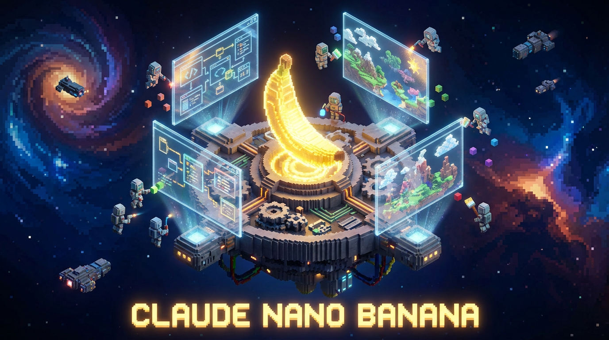

<p align="center">
  
</p>

<p align="center">
  <a href="https://github.com/flight505/nano-banana"></a>
  <a href="LICENSE"></a>
  <a href="https://github.com/anthropics/claude-code"></a>
</p>

<p align="center">
  <strong>AI-powered image, diagram, and video generation for Claude Code</strong><br>
  Using Google Gemini API and Veo 3.1 with intelligent quality review
</p>

---

## Features

- **google-genai SDK** - Single SDK for all Gemini and Veo models
- **Video Generation** - Veo 3.1 text-to-video, image-to-video, frame interpolation
- **Smart Iteration** - Only regenerates when quality is below threshold (saves API calls)
- **Document-Type Aware** - 13 quality presets (journal, architecture, presentation, etc.)
- **AI Quality Review** - Gemini 3.1 Pro reviews each diagram generation
- **Four Skills** - Technical diagrams, general images, video generation, and text-based diagram rendering
- **Image Editing** - Modify existing images with natural language

## Quick Start

### 1. Install the Plugin

```bash
git clone https://github.com/flight505/nano-banana.git
```

### 2. Install Dependencies

```bash
uv sync  # or: pip install google-genai
```

### 3. Configure API Key

Get a key at [Google AI Studio](https://aistudio.google.com/apikey):

```bash
export GEMINI_API_KEY='your-gemini-key-here'
```

Or use a `.env` file in your project:

```bash
echo "GEMINI_API_KEY=your-key-here" > .env
```

### 4. Generate!

```bash
# Technical diagram with quality review
python3 skills/diagram/scripts/generate_diagram.py \
    "Microservices architecture with API gateway" \
    -o architecture.png \
    --doc-type architecture

# Creative image
python3 skills/image/scripts/generate_image.py \
    "A cozy coffee shop on a rainy day" \
    -o coffee_shop.png

# Edit an existing image
python3 skills/image/scripts/generate_image.py \
    "Add rain to the window" \
    --input coffee_shop.png -o rainy_coffee_shop.png

# Generate a video
python3 skills/video/scripts/generate_video.py \
    "A time-lapse of clouds over a mountain" \
    -o clouds.mp4

# Image-to-video (animate a still image)
python3 skills/video/scripts/generate_video.py \
    "Slowly pan across the scene" \
    --input landscape.png -o animated.mp4
```

## Skills

### Diagram Skill

Generate publication-quality technical diagrams with AI quality review.

```bash
python3 skills/diagram/scripts/generate_diagram.py "User authentication flow" -o auth.png --doc-type architecture
```

**Document Types:**
| Type | Threshold | Use Case |
|------|-----------|----------|
| `specification` | 8.5/10 | Technical specs, PRDs |
| `architecture` | 8.0/10 | System architecture |
| `journal` | 8.5/10 | Academic papers |
| `presentation` | 6.5/10 | Slides (faster) |
| `readme` | 7.0/10 | Documentation |

[Full Diagram Documentation](skills/diagram/SKILL.md)

### Image Skill

Generate and edit images using various AI models.

```bash
# Generate
python3 skills/image/scripts/generate_image.py "Abstract art in blue and gold" -o art.png

# Edit existing image
python3 skills/image/scripts/generate_image.py "Make the sky purple" --input photo.jpg -o edited.png
```

**Available Models:**
- `gemini-3.1-flash-image-preview` (default — Nano Banana 2, fastest)
- `gemini-3.1-pro-image-preview` (Nano Banana Pro, highest quality)

**Aspect Ratio & Resolution:**
```bash
# Generate with specific aspect ratio and resolution
python3 skills/image/scripts/generate_image.py \
    "A wide cinematic landscape" -o landscape.png \
    --aspect-ratio 16:9 --resolution 2K
```

[Full Image Documentation](skills/image/SKILL.md)

### Kroki Skill

Render text-based diagrams (Mermaid, PlantUML, GraphViz, D2, and 23 more) to PNG/SVG.

```bash
# Render Mermaid to PNG
python3 skills/kroki/scripts/render_diagram.py -t mermaid -o flow.png \
    --source 'flowchart LR; A-->B-->C'

# Render PlantUML to SVG
python3 skills/kroki/scripts/render_diagram.py -t plantuml -i diagram.puml -o diagram.svg

# List all 27 supported types
python3 skills/kroki/scripts/render_diagram.py --list-types
```

[Full Kroki Documentation](skills/kroki/SKILL.md)

### Video Skill

Generate videos using Veo 3.1 — text-to-video, image-to-video, frame interpolation, and video extension.

```bash
# Text-to-video
python3 skills/video/scripts/generate_video.py "A rocket launching into space" -o launch.mp4

# Image-to-video (animate an image)
python3 skills/video/scripts/generate_video.py "Zoom into the scene" --input photo.png -o animated.mp4
```

**Available Models:**
- `veo-3.1-fast-generate-preview` (default — fast generation)
- `veo-3.1-generate-preview` (higher quality, slower)

[Full Video Documentation](skills/video/SKILL.md)

## When to Use Which Skill

| Need | Use |
|------|-----|
| Architecture diagrams (from description) | `diagram` |
| Flowcharts with boxes (from description) | `diagram` |
| ERD / data models (from description) | `diagram` |
| Photos / artistic images | `image` |
| Edit existing photos | `image` |
| Video demos / animations | `video` |
| Animate a still image | `video` |
| Render Mermaid/PlantUML/DOT source | `kroki` |
| Render D2/C4/Excalidraw source | `kroki` |

## Configuration

### Environment Variables

| Variable | Required | Description |
|----------|----------|-------------|
| `GEMINI_API_KEY` | Yes | Google Gemini API key ([get one here](https://aistudio.google.com/apikey)) |

### Dependencies

- **Python 3.10+**
- **google-genai** SDK: `uv sync` or `pip install google-genai`
- **ffmpeg** (optional): for video audio stripping

### Setup Command

Run `/nano-banana:setup` in Claude Code for interactive configuration.

## Cost Estimates

| Operation | Estimated Cost |
|-----------|---------------|
| Simple diagram (1 iteration) | $0.05-0.15 |
| Complex diagram (2 iterations) | $0.10-0.30 |
| Image generation (Gemini) | Free tier / ~$0.02-0.10 |
| Video generation (Veo 3.1) | ~$0.10-0.50 |

Smart iteration saves costs by stopping early when quality meets threshold.

## Plugin Structure

```
nano-banana/
├── .claude-plugin/
│   └── plugin.json              # Plugin manifest
├── commands/
│   ├── edit.md                  # /nano-banana:edit command
│   └── setup.md                 # /nano-banana:setup command
├── hooks/
│   ├── hooks.json               # PostToolUse hook declarations
│   └── validate-output.py       # Output validation + error recovery
├── skills/
│   ├── common/                  # Shared utilities
│   │   ├── __init__.py
│   │   ├── client.py            # google-genai client factory
│   │   ├── env.py               # Unified .env file loading
│   │   └── image_utils.py       # PNG conversion, MIME types, base64
│   ├── diagram/                 # Technical diagram generation
│   │   ├── SKILL.md
│   │   └── scripts/
│   │       ├── generate_diagram.py      # CLI wrapper
│   │       └── generate_diagram_ai.py   # AI generation + review logic
│   ├── image/                   # General image generation
│   │   ├── SKILL.md
│   │   └── scripts/
│   │       └── generate_image.py        # Image generation/editing
│   ├── video/                   # Video generation
│   │   ├── SKILL.md
│   │   └── scripts/
│   │       └── generate_video.py        # Veo 3.1 video generation
│   └── kroki/                   # Text-based diagram rendering
│       ├── SKILL.md
│       └── scripts/
│           └── render_diagram.py        # Kroki.io rendering (27 types)
├── ARCHITECTURE.md              # Technical architecture documentation
├── CHANGELOG.md                 # Version history
├── CLAUDE.md                    # Developer instructions
├── pyproject.toml               # Python packaging (uv/pip)
└── README.md
```

## License

MIT License - see [LICENSE](LICENSE) for details.

## Acknowledgments

- [Google Gemini](https://deepmind.google/technologies/gemini/) for image and video generation APIs
- [Claude Code](https://github.com/anthropics/claude-code) for the plugin platform
- Inspired by the [Claude Project Planner](https://github.com/flight505/claude-project-planner) plugin

## Issues & Contributions

- Report issues: [GitHub Issues](https://github.com/flight505/nano-banana/issues)
- Contributions welcome via Pull Requests

---

**Made with Nano Banana by [flight505](https://github.com/flight505)**
