# Nano Banana - Mermaid Diagrams

## Overview

Create diagrams using Mermaid's text-based syntax. Mermaid diagrams are version-controllable, render natively in GitHub/GitLab, and are perfect for documentation.

**Key Features:**
- 📝 **Text-Based**: Diagrams as code, easy to version control
- 🔄 **Git-Friendly**: Diff-able, merge-able, reviewable
- 🌐 **Wide Support**: GitHub, GitLab, Notion, Obsidian, and more
- 🎨 **Customizable**: Themes and styling options

## When to Use Mermaid

| Use Mermaid When... | Use AI Diagrams When... |
|---------------------|------------------------|
| Diagrams need version control | One-off visualization needed |
| Team collaboration on diagrams | High visual polish required |
| Diagrams in markdown docs | Complex custom styling needed |
| Frequent diagram updates | Photo-realistic or artistic |
| GitHub/GitLab rendering | Publication-quality required |

## Supported Diagram Types

### 1. Flowcharts

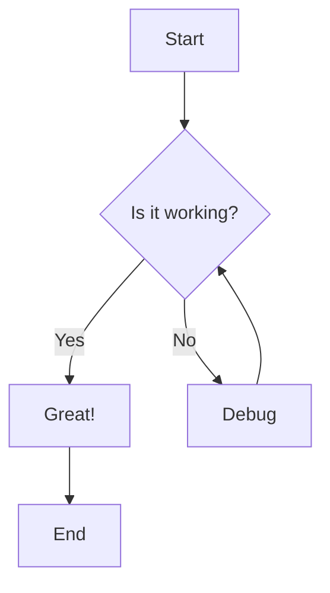

**Syntax:**
```
flowchart TD
    A[Start] --> B{Is it working?}
    B -->|Yes| C[Great!]
    B -->|No| D[Debug]
    D --> B
    C --> E[End]
```

**Directions:** `TD` (top-down), `LR` (left-right), `BT` (bottom-top), `RL` (right-left)

**Node Shapes:**
- `[text]` - Rectangle
- `(text)` - Rounded rectangle
- `{text}` - Diamond (decision)
- `([text])` - Stadium
- `[[text]]` - Subroutine
- `[(text)]` - Cylinder (database)

### 2. Sequence Diagrams

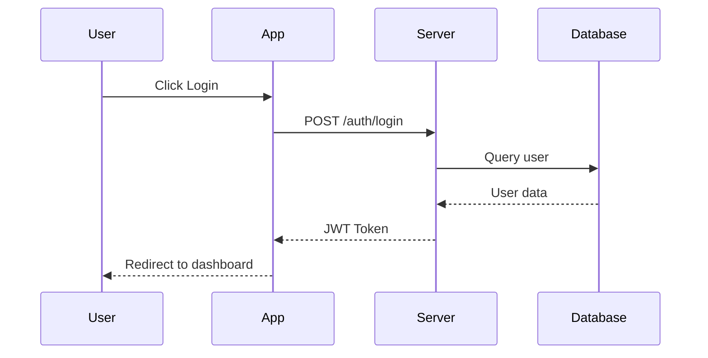

**Syntax:**
```
sequenceDiagram
    participant U as User
    participant A as App
    participant S as Server

    U->>A: Request
    A->>S: Forward
    S-->>A: Response
    A-->>U: Display
```

**Arrow Types:**
- `->` Solid line without arrow
- `-->` Dotted line without arrow
- `->>` Solid line with arrow
- `-->>` Dotted line with arrow
- `-x` Solid line with X
- `--x` Dotted line with X

### 3. Class Diagrams

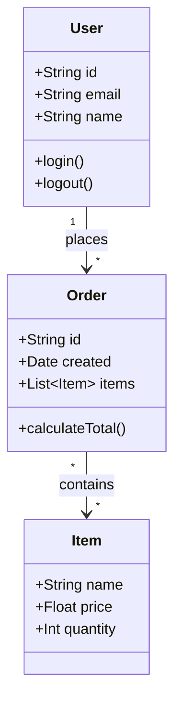

### 4. Entity Relationship Diagrams

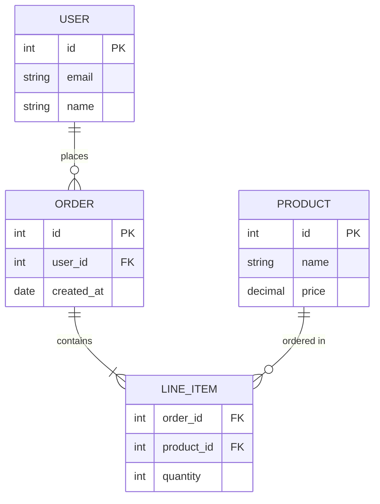

**Relationship Syntax:**
- `||--||` One to one
- `||--o{` One to many
- `}o--o{` Many to many

### 5. State Diagrams

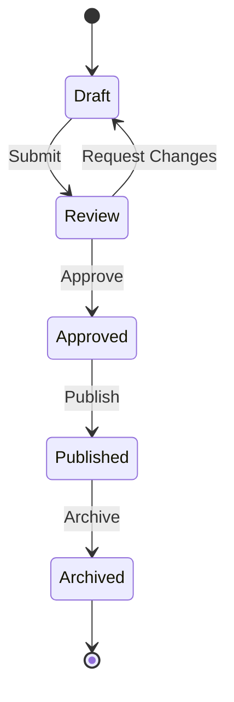

### 6. Gantt Charts

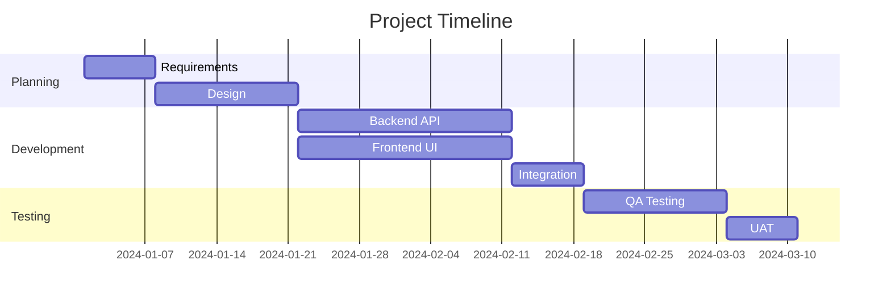

### 7. Pie Charts

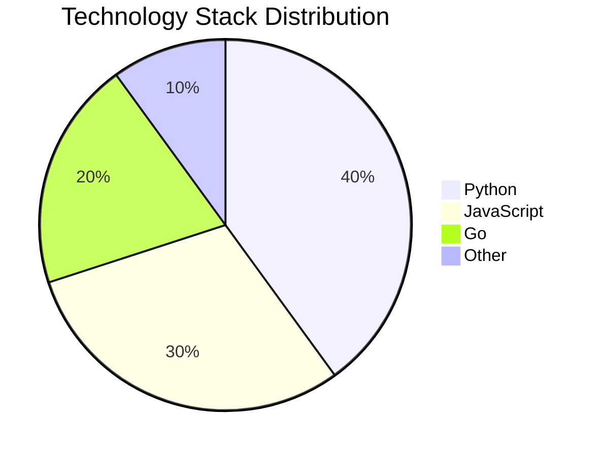

### 8. Git Graphs

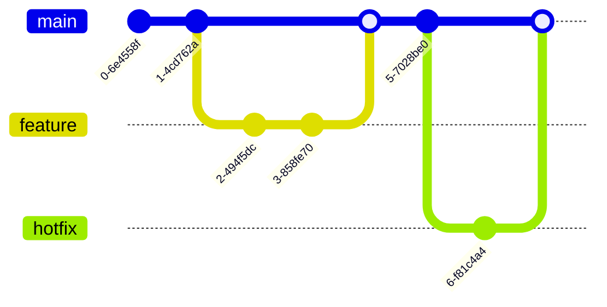

## Using Mermaid in Documentation

### In Markdown Files

~~~markdown
# Architecture Overview

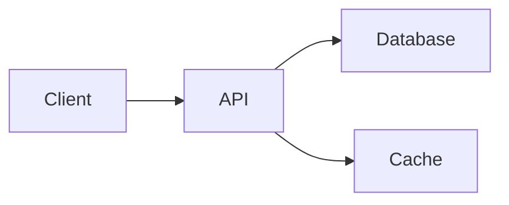
~~~

### In GitHub README

GitHub automatically renders Mermaid in markdown files. Just use the fenced code block with `mermaid` language identifier.

### Export to PNG/SVG

Use Mermaid CLI for image export:

```bash
# Install Mermaid CLI
npm install -g @mermaid-js/mermaid-cli

# Export to PNG
mmdc -i diagram.mmd -o diagram.png

# Export to SVG
mmdc -i diagram.mmd -o diagram.svg

# With custom theme
mmdc -i diagram.mmd -o diagram.png -t dark
```

## Themes

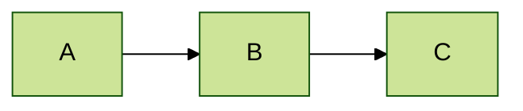

**Available Themes:**
- `default` - Default Mermaid theme
- `forest` - Green tones
- `dark` - Dark mode
- `neutral` - Grayscale
- `base` - Minimal styling

## Best Practices

### Keep It Simple
```
# ✅ Good - Clear and readable
flowchart LR
    A[Input] --> B[Process] --> C[Output]

# ❌ Avoid - Too complex
flowchart LR
    A --> B --> C --> D --> E --> F --> G --> H
    B --> X --> Y --> Z
    C --> X
    D --> Y
```

### Use Meaningful Labels
```
# ✅ Good - Descriptive labels
flowchart TD
    Auth[Authentication Service] --> Users[(User Database)]

# ❌ Avoid - Generic labels
flowchart TD
    A --> B
```

### Group Related Elements
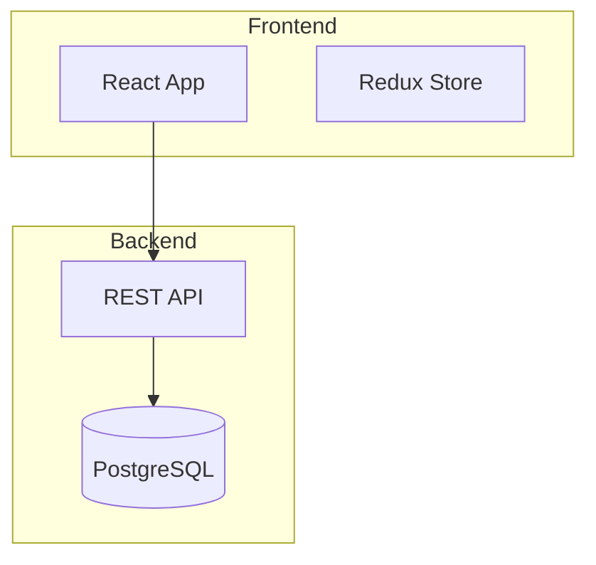

## Integration with Nano Banana

For simple, version-controlled diagrams → Use **Mermaid**
For publication-quality, complex visuals → Use **diagram** skill

**Hybrid Approach:**
1. Draft diagram structure in Mermaid
2. Iterate on the design in version control
3. When finalized, generate polished version with `diagram` skill

## Resources

- [Mermaid Documentation](https://mermaid.js.org/intro/)
- [Live Editor](https://mermaid.live/)
- [Mermaid CLI](https://github.com/mermaid-js/mermaid-cli)
- [GitHub Mermaid Support](https://docs.github.com/en/get-started/writing-on-github/working-with-advanced-formatting/creating-diagrams)
